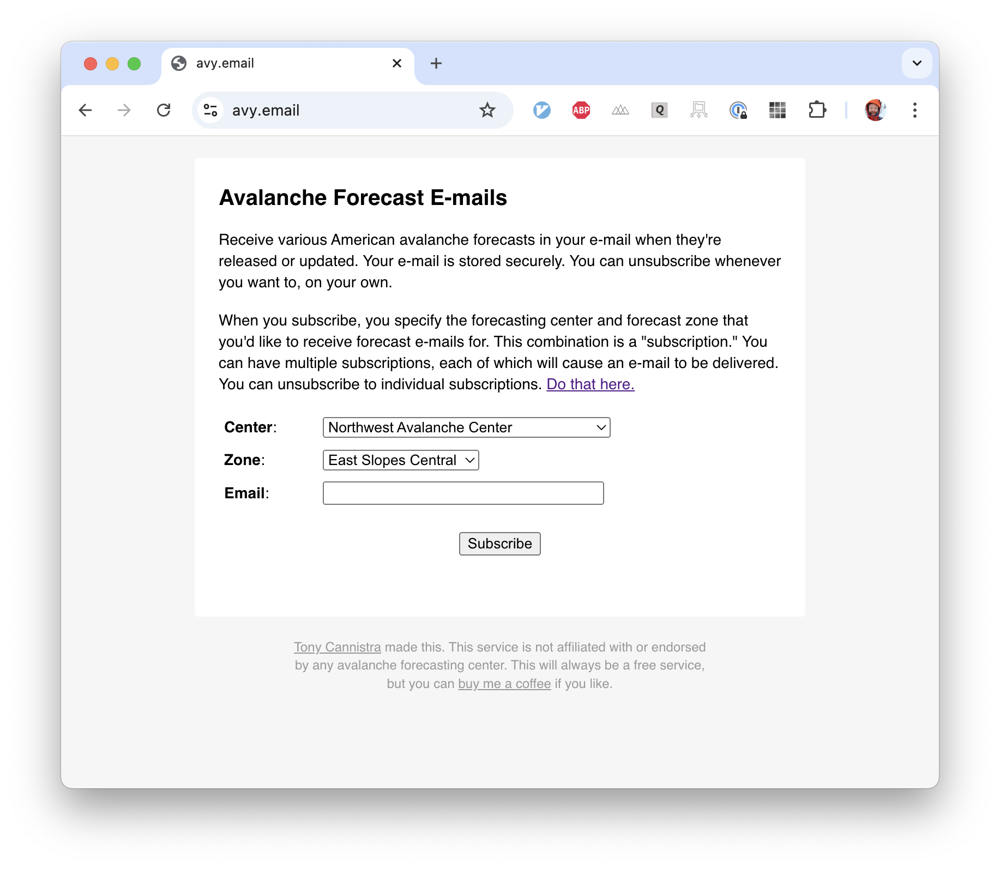

# [`avymail`](https://avy.email)

Get various American avalanche forecasts in your e-mail. [Sign up.](https://avy.email)

  

This repository contains:

- a [wrapper for the NAC API](./avalanche.py) to retrieve forecasts
- a [REST API](./api.py) and [HTML/JS](./web/) for managing subscriptions, hosted on fly.io
- a [S3-backed record store](./s3records.py) as a simple database
- a [template](./mailtemplate.html) and [cron script](./send-avymail.py) for sending emails via AWS SES, run in Github Actions
